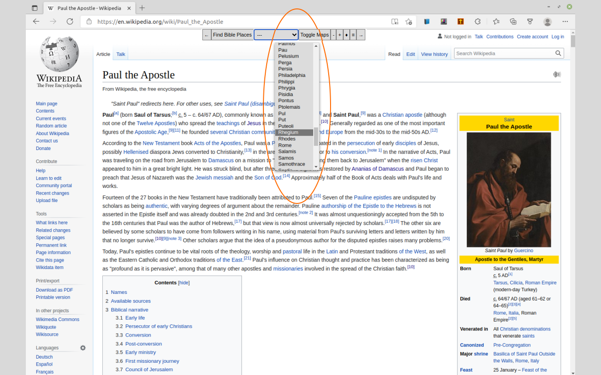

# findBiblePlaces
This is a browser plugin that will scan a web page for lists of places in the Bible and forward you to a map showing its location.

It is available at the Chrome Web Store at:

https://chrome.google.com/webstore/detail/bible-place-finder/jgcmipcomajhnpadgflebokbckendncc

## Overview
This extension helps the user locate geographic places listed in the Bible and facilitates viewing them on maps.

It will search your current page for any geographic listing that appears in the Bible.  Then it will make a list of what it finds.

You can then view the place on one of several Biblical maps or see the location on Google Maps.

If you are reading anything Bible related and just want a streamlined method for finding Bible places on a map, this extension is for you.  It is useful if you are reading the Bible online, commentary, articles or anything Bible related in your Chrome browser.

The extension works by looking through relevant elements on the web page, looking at the text they contain and making a single long string of characters.

The program then looks through a known list geographic regions and checks to see if these names are found in the long string of characters.  If these names are present they are added to the list of found locations in a drop-down list.

You can then select a location and the coordinates of that location are used to plot a marker on a map of your choice, or the location can be displayed on Google Maps.

You can also zoom in or out on the map for more or less detail.

The latest version of Bible Place Finder uses a better algorithm which finds more places on each page.  Additionally, it works better with the most popular commentary websites, which tend to contain a lot of integrated links within the inner text.

The search algorithm does take a little longer but gives much more satisfactory results.

This search algorithm finds everything the previous algorithm found but more to added locations and an improved algorithm.  Additionally, it provides the same identical Google Maps link as the previous version.  Instead of clicking on the drop down selection though, you open the maps window and click on the Google Maps button.

Also, when the map area is displayed, a latitude and longitude will be displayed as well as if the location has gone off the map.

New in this latest version, the Arrow ↑ will stick the map to the top of the page.  The Arrow ↓ designates that the the map will stay fixed with scrolling.  

Arrows (←/→) allow for docking to the left, right, or center.  There is a minimize button ≡, and there is a ♦/◊ button which changes to semi-transparent or solid color.

For the tech savvy, you can also get a list of found locations, elapsed search time, and coordinates in the browser console.

The list of geographic areas and latitude/longitude values are taken from the OpenBible.info project.  

The maps are taken from the wonderful historical publication "Bible Dictionary, Teacher's Edition 1" (Smith), which was originally published over 158 years ago in 1863 subject to Fair Use.

#### References:

https://github.com/openbibleinfo/Bible-Geocoding-Data

https://www.openbible.info/geo/

Smith, Sir William, et al. A Dictionary of the Bible; Comprising Its Antiquities, Biography, Geography, Natural History and Literature, with the Latest Researches and References to the Revised Version of the New Testament. The John C. Winston Company, 1884.
